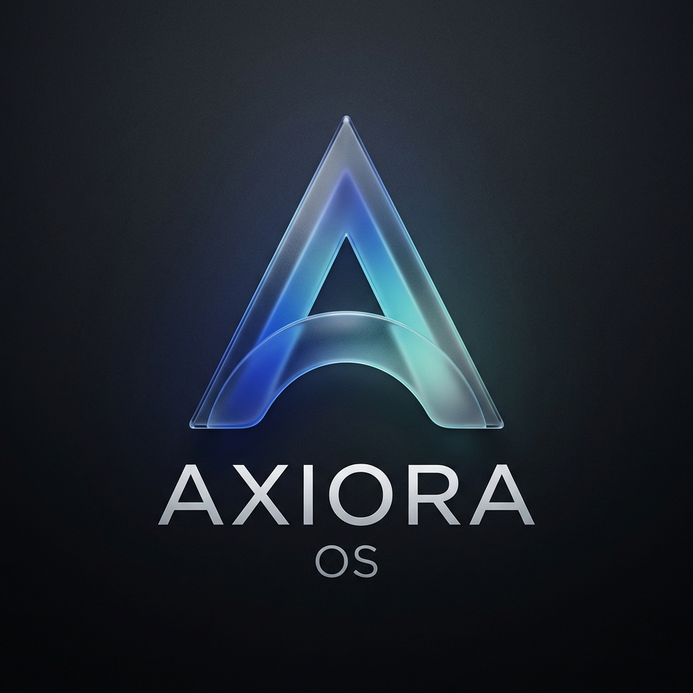

<div align="center">
  
  <h1>Axiora OS</h1>
  <p><strong>A modern, fast, and beautiful Linux desktop experience.</strong></p>
  
  <p>
    <a href="https://github.com/furqan-debug/axiora-os/actions/workflows/build-iso.yml"></a>
    <a href="https://github.com/furqan-debug/axiora-os/blob/master/LICENSE"></a>
    
  </p>
</div>

---

**Axiora OS** is an open-source desktop environment layer built on top of the rock-solid Ubuntu 22.04 LTS foundation. It is designed to be visually stunning, blazingly fast, and respectful of your privacy. 

This repository contains everything needed to build the Axiora Desktop Shell, the backend system daemons, and the bootable ISO.

## ✨ Features

- **Floating Glass Dock:** A centered dock with smooth micro-animations and live indicators for running applications.
- **Search Launcher:** A frosted glass overlay to instantly find and launch your apps.
- **Notification Center & Quick Settings:** Manage Wi-Fi, Bluetooth, and system settings from a unified slide-out panel.
- **Focus Mode:** Silence all notifications with a single click — powered by a thread-safe Rust DBus daemon.
- **Personalisation:** Choose from five beautiful accent colours (Axiora Blue, Purple, Emerald Green, Sunset Orange, Crimson Red) that apply system-wide.
- **Privacy First:** Zero telemetry. Everything stays on your machine.

## 🏗️ Architecture

Axiora is built with modern, performant web and system technologies:

- **Frontend Shell (`/shell`):** Built with React, TypeScript, and Vite. Uses raw CSS to achieve fluid, hardware-accelerated frosted glass animations. Wrapped as a transparent, frameless desktop overlay using **Tauri**.
- **Backend Daemons (`/services`):** Written in **Rust**. Uses `zbus` and `tokio` to create lightweight, memory-safe system DBus services that manage notifications, dock state, and focus mode.
- **ISO Builder (`/installer`):** Fully automated via GitHub Actions using **Cubic** to bake the shell, daemons, Plymouth boot splash, and GRUB themes into a ready-to-flash `.iso`.

## 🚀 Getting Started

### 1. Download the ISO
Head to the [Releases](../../releases) page to download the latest bootable `.iso` file. Flash it to a USB drive using Rufus or BalenaEtcher to install it on your PC.

### 2. Run the UI Locally (For Developers)
Want to hack on the UI without building the whole OS? You can run the React frontend natively on your current machine (Windows/macOS/Linux):

```bash
# Clone the repository
git clone https://github.com/furqan-debug/axiora-os.git
cd axiora-os/shell

# Install dependencies and start the dev server
npm install
npm run dev
```

### 3. Build the ISO from source
To build the `.iso` yourself, run our automated pipeline on an Ubuntu 22.04 host:
```bash
bash infra/setup_ubuntu.sh
bash packaging/deb/build-deb.sh
# Then use Cubic to inject the installer scripts
```

## 🤝 Contributing
Axiora OS is open source and community-driven. If you'd like to contribute, check out our [Contributing Guidelines](CONTRIBUTING.md) to get started!

## 📄 License
This project is licensed under the MIT License - see the [LICENSE](LICENSE) file for details.
